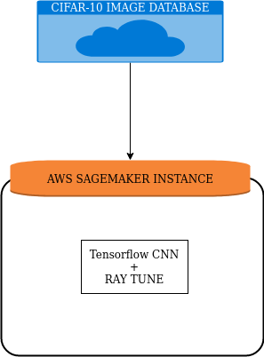

## Scope of the activity
· Understanding a Deep Learning pipeline for image recognition
· Build a custom CNN model by defining layers and activation function.
· Training the custom model.
· Create Realtime Visualization using TensorBoard and observe the training performance.
· Use apache Ray to perform hyper-parameter tuning and tune the custom model hyperparameters to improve the performance.
· Use standard CNN architectures (vgg16, Resnet) for model. Train using transfer learning and compare the performance with your custom model.

## Tech Stack
 * Tensorflow (Deep Learning Framework)
 * Ray Tune
 * SageMaker

## Architecture
We are using CIFAR-10 image database from cloud and running the instance
on aws sagemaker to run the tensorflow + raytune code.

